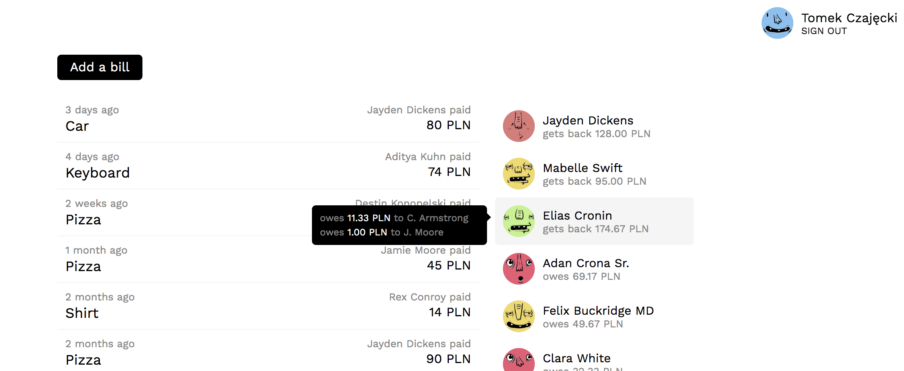

# spendshare

## TODO:
- replace `next.js` with simple React SPA (to skip problems with persisting authentication and so on)
- use Google OAuth for authenticating users
- create backend and test it
